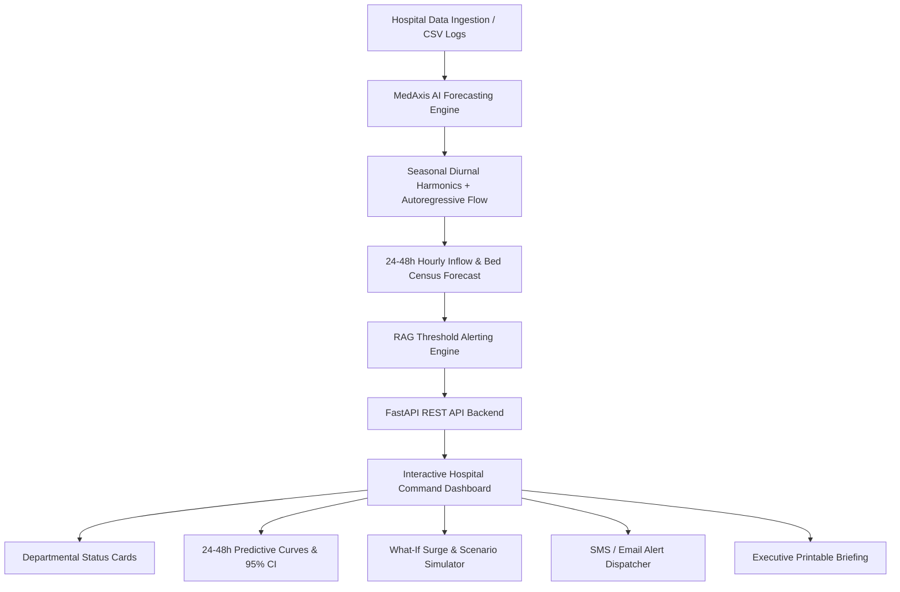

# MedAxis: AI-Driven Predictive Hospital Bed & Patient-Flow Forecasting ,
[](https://medaxis-hospital-forecasting.onrender.com)

> 🔗 **Public Prototype URL**: [https://medaxis-hospital-forecasting.onrender.com](https://medaxis-hospital-forecasting.onrender.com)

[](https://www.python.org/)
[](https://fastapi.tiangolo.com/)
[](https://scikit-learn.org/)
[](https://tailwindcss.com/)
[](https://www.chartjs.org/)
[]()
[](https://opensource.org/licenses/MIT)

> **From Hackathon Prototype to a Deployable Web AI Application**  
> Focus feature: *24–48 hour hospital bed-occupancy & patient-inflow forecasting with automated Red/Amber/Green (RAG) threshold alerting and clinical decision support.*

---

## 📌 Executive Summary & Problem Context

Hospital emergency departments and inpatient wards routinely operate at or near capacity. Traditional bed-allocation decisions are **largely reactive** — nursing supervisors and bed managers only discover bed shortages after patients begin boarding in hallways, ambulances are diverted, or elective surgeries are canceled last-minute.

**MedAxis** transforms hospital capacity management from **reactive scrambling to proactive scheduling** by providing:
1. **24–48 Hour Hourly Predictive Census**: Machine learning forecasting of patient admissions, discharges, and bed occupancy across multiple wards.
2. **Automated RAG Threshold Alerts**: Red (>90%), Amber (75–90%), and Green (<75%) threshold alerts paired with actionable clinical countermeasures.
3. **Interactive "What-If" Scenario Simulator**: Real-time stress testing for epidemic surges (e.g., Dengue/Flu spikes), mass casualty incidents, and discharge bottlenecks.
4. **Self-Serve, Low-Friction Deployment**: Zero expensive hardware requirements; runs in lightweight cloud or on-premise environments with CSV log ingestion.

---

## 📊 Market Opportunity & Competitive Positioning

According to third-party healthcare market intelligence (*Fact.MR, Mordor Intelligence 2026*):
- The **AI in hospital operations market** is valued at **$10–12 billion (2025–26)**, expanding at a **16.1% CAGR to $52.4B by 2036**.
- **Hospital workflow automation and bed/patient-flow management** represent the largest single share (**~39%**) of AI operational spend.
- Published clinical studies (*BMC Medical Informatics & Decision Making 2026*) validate that interpretable time-series models reduce total bed requirements by **up to 53.7%** and patient waiting times by **63.9%**.

### Competitive Landscape Matrix

| Vendor | Core Offering | Deployment Model | Limitation / MedAxis Advantage |
| :--- | :--- | :--- | :--- |
| **LeanTaaS (iQueue)** | Predictive OR & Infusion capacity | Enterprise, custom pricing | Inaccessible to single wards / Tier-2/3 hospitals |
| **Qventus** | AI operational automation | Enterprise multi-year contracts | High cost; 6–12 month implementation cycle |
| **TeleTracking** | Real-time bed visibility | Hardware + Software suite | Focuses on tracking, weak on predictive ML forecasting |
| **GE HealthCare Command** | Enterprise census forecasting | Large hospital networks | Heavy change management overhead and pricing |
| **MocDoc / NuvertOS** | Cloud hospital management | Regional SaaS | Administrative ERP only; lacks predictive AI forecasting |
| **MedAxis (Ours)** | **24–48h Bed & Inflow AI Forecast** | **Self-serve Web AI App** | **Rapid setup (minutes), low cost, interpretable, RAG alerts** |

---

## 🏗️ System Architecture



### Departmental Wards Supported
- **Emergency Department (ED)**: 50 beds &bull; High turnover with evening peak intake (15:00–22:00).
- **Intensive Care Unit (ICU)**: 30 beds &bull; Bottleneck unit with high length-of-stay and critical care reserve.
- **General Medicine Ward**: 120 beds &bull; Morning discharge cycles (09:00–12:00) with afternoon intake.
- **Surgical & Post-Op Ward**: 80 beds &bull; Weekday scheduled elective loads combined with emergency trauma.
- **Pediatric Ward**: 40 beds &bull; Specialized pediatric inpatient care with family-assisted discharge paths.

---

## 🚀 Quick Start Guide

### Prerequisites
- **Python 3.10+** (Tested on Python 3.10, 3.11, 3.12, 3.13, 3.14)
- Web Browser (Chrome, Edge, Firefox, Safari)

### 1. Clone & Navigate to Project
```bash
git clone https://github.com/<your-username>/medaxis-hospital-forecasting.git
cd medaxis-hospital-forecasting
```

### 2. Install Dependencies
```bash
python -m pip install -r requirements.txt
```

### 3. Launch the Application
#### Windows:
Double-click `start.bat` or run:
```bash
python run.py
```

#### Linux / macOS:
```bash
chmod +x start.sh
./start.sh
```

### 4. Open in Browser
Visit **[http://127.0.0.1:8000](http://127.0.0.1:8000)** to access the MedAxis Command Center.  
Interactive API Swagger Docs: **[http://127.0.0.1:8000/docs](http://127.0.0.1:8000/docs)**

---

## 🧪 Automated Verification & Testing

To run the complete 5-stage automated test suite:
```bash
python test_system.py
```

**Test Coverage:**
- `[1/5]` Multi-ward historical time series dataset generation
- `[2/5]` AI 24h & 48h forecasting math and 95% confidence bounds
- `[3/5]` What-If scenario simulation (Viral surge, MCI, Discharge bottleneck)
- `[4/5]` Clinical threshold evaluation and SMS notification dispatch
- `[5/5]` FastAPI asynchronous REST endpoints (`/api/summary`, `/api/forecast`, `/api/simulate`, `/api/alerts`)

---

---

## 🧪 Prototype Sample Ingestion Dataset

MedAxis includes a standardized 48-hour prototype dataset (`data/sample_prototype_insert.csv`) representing real-world hourly hospital admissions, discharges, and bed occupancy across **Emergency (ED)** and **Intensive Care (ICU)** units.

[]()
[]()
[]()
[](file:///C:/Users/Sivadath.R/.gemini/antigravity/scratch/medaxis-hospital-forecasting/data/sample_prototype_insert.csv)

### 📋 Dataset Schema & Data Dictionary

| Column Name | Data Type | Example Value | Description & Clinical Utility |
| :--- | :--- | :--- | :--- |
| `timestamp` | `YYYY-MM-DD HH:MM:SS` | `2026-08-16 15:00:00` | Hourly observation timestamp for time-series forecasting |
| `ward` | `String` | `Emergency`, `ICU` | Departmental ward identifier |
| `occupied_beds` | `Integer` | `42` | Total active inpatient bed census at that hour |
| `total_beds` | `Integer` | `50` | Operational capacity ceiling of the ward |
| `admissions` | `Integer` | `6` | Newly admitted patients in that 1-hour window |
| `discharges` | `Integer` | `4` | Discharged / transferred patients in that 1-hour window |

### 🔍 Sample Data Preview (First 16 Records)

```csv
timestamp,ward,occupied_beds,total_beds,admissions,discharges
2026-08-16 15:00:00,Emergency,42,50,2,1
2026-08-16 15:00:00,ICU,24,30,2,1
2026-08-16 16:00:00,Emergency,42,50,4,2
2026-08-16 16:00:00,ICU,24,30,0,0
2026-08-16 17:00:00,Emergency,45,50,2,2
2026-08-16 17:00:00,ICU,27,30,1,1
2026-08-16 18:00:00,Emergency,45,50,3,2
2026-08-16 18:00:00,ICU,23,30,2,2
2026-08-16 19:00:00,Emergency,45,50,4,4
2026-08-16 19:00:00,ICU,24,30,0,2
2026-08-16 20:00:00,Emergency,36,50,4,4
2026-08-16 20:00:00,ICU,27,30,1,2
2026-08-16 21:00:00,Emergency,42,50,5,1
2026-08-16 21:00:00,ICU,28,30,2,2
2026-08-16 22:00:00,Emergency,42,50,3,2
2026-08-16 22:00:00,ICU,23,30,1,2
```

<details>
<summary><b>👉 Click here to expand the full 96-row prototype dataset</b></summary>

```csv
timestamp,ward,occupied_beds,total_beds,admissions,discharges
2026-08-16 15:00:00,Emergency,42,50,2,1
2026-08-16 15:00:00,ICU,24,30,2,1
2026-08-16 16:00:00,Emergency,42,50,4,2
2026-08-16 16:00:00,ICU,24,30,0,0
2026-08-16 17:00:00,Emergency,45,50,2,2
2026-08-16 17:00:00,ICU,27,30,1,1
2026-08-16 18:00:00,Emergency,45,50,3,2
2026-08-16 18:00:00,ICU,23,30,2,2
2026-08-16 19:00:00,Emergency,45,50,4,4
2026-08-16 19:00:00,ICU,24,30,0,2
2026-08-16 20:00:00,Emergency,36,50,4,4
2026-08-16 20:00:00,ICU,27,30,1,2
2026-08-16 21:00:00,Emergency,42,50,5,1
2026-08-16 21:00:00,ICU,28,30,2,2
2026-08-16 22:00:00,Emergency,42,50,3,2
2026-08-16 22:00:00,ICU,23,30,1,2
2026-08-16 23:00:00,Emergency,44,50,6,4
2026-08-16 23:00:00,ICU,22,30,1,2
2026-08-17 00:00:00,Emergency,42,50,4,1
2026-08-17 00:00:00,ICU,25,30,2,0
2026-08-17 01:00:00,Emergency,40,50,2,2
2026-08-17 01:00:00,ICU,27,30,2,1
2026-08-17 02:00:00,Emergency,43,50,4,4
2026-08-17 02:00:00,ICU,24,30,1,2
2026-08-17 03:00:00,Emergency,43,50,6,5
2026-08-17 03:00:00,ICU,28,30,1,1
2026-08-17 04:00:00,Emergency,34,50,4,5
2026-08-17 04:00:00,ICU,25,30,2,1
2026-08-17 05:00:00,Emergency,43,50,4,5
2026-08-17 05:00:00,ICU,28,30,1,0
2026-08-17 06:00:00,Emergency,48,50,6,2
2026-08-17 06:00:00,ICU,22,30,2,1
2026-08-17 07:00:00,Emergency,36,50,3,4
2026-08-17 07:00:00,ICU,28,30,0,0
2026-08-17 08:00:00,Emergency,47,50,6,1
2026-08-17 08:00:00,ICU,26,30,0,1
2026-08-17 09:00:00,Emergency,35,50,5,4
2026-08-17 09:00:00,ICU,23,30,0,0
2026-08-17 10:00:00,Emergency,40,50,4,3
2026-08-17 10:00:00,ICU,24,30,2,1
2026-08-17 11:00:00,Emergency,44,50,6,4
2026-08-17 11:00:00,ICU,24,30,1,1
2026-08-17 12:00:00,Emergency,44,50,6,4
2026-08-17 12:00:00,ICU,24,30,1,1
2026-08-17 13:00:00,Emergency,48,50,5,3
2026-08-17 13:00:00,ICU,22,30,0,1
2026-08-17 14:00:00,Emergency,41,50,5,3
2026-08-17 14:00:00,ICU,22,30,0,0
2026-08-17 15:00:00,Emergency,40,50,6,4
2026-08-17 15:00:00,ICU,24,30,2,1
2026-08-17 16:00:00,Emergency,46,50,6,2
2026-08-17 16:00:00,ICU,24,30,2,0
2026-08-17 17:00:00,Emergency,39,50,2,4
2026-08-17 17:00:00,ICU,25,30,1,1
2026-08-17 18:00:00,Emergency,39,50,2,2
2026-08-17 18:00:00,ICU,23,30,1,1
2026-08-17 19:00:00,Emergency,38,50,2,5
2026-08-17 19:00:00,ICU,26,30,2,1
2026-08-17 20:00:00,Emergency,48,50,4,1
2026-08-17 20:00:00,ICU,23,30,0,0
2026-08-17 21:00:00,Emergency,42,50,5,5
2026-08-17 21:00:00,ICU,25,30,0,2
2026-08-17 22:00:00,Emergency,46,50,3,3
2026-08-17 22:00:00,ICU,28,30,1,0
2026-08-17 23:00:00,Emergency,45,50,2,4
2026-08-17 23:00:00,ICU,22,30,0,1
2026-08-18 00:00:00,Emergency,37,50,2,5
2026-08-18 00:00:00,ICU,24,30,1,0
2026-08-18 01:00:00,Emergency,48,50,3,5
2026-08-18 01:00:00,ICU,27,30,1,0
2026-08-18 02:00:00,Emergency,36,50,2,3
2026-08-18 02:00:00,ICU,27,30,0,2
2026-08-18 03:00:00,Emergency,43,50,6,2
2026-08-18 03:00:00,ICU,22,30,2,1
2026-08-18 04:00:00,Emergency,45,50,2,2
2026-08-18 04:00:00,ICU,24,30,2,2
2026-08-18 05:00:00,Emergency,34,50,6,4
2026-08-18 05:00:00,ICU,27,30,0,2
2026-08-18 06:00:00,Emergency,41,50,6,4
2026-08-18 06:00:00,ICU,28,30,2,1
2026-08-18 07:00:00,Emergency,36,50,4,3
2026-08-18 07:00:00,ICU,23,30,2,1
2026-08-18 08:00:00,Emergency,35,50,3,3
2026-08-18 08:00:00,ICU,25,30,2,1
2026-08-18 09:00:00,Emergency,42,50,2,3
2026-08-18 09:00:00,ICU,24,30,0,1
2026-08-18 10:00:00,Emergency,37,50,4,4
2026-08-18 10:00:00,ICU,28,30,2,1
2026-08-18 11:00:00,Emergency,38,50,6,1
2026-08-18 11:00:00,ICU,26,30,1,1
2026-08-18 12:00:00,Emergency,44,50,3,5
2026-08-18 12:00:00,ICU,24,30,2,0
2026-08-18 13:00:00,Emergency,48,50,4,5
2026-08-18 13:00:00,ICU,28,30,2,2
2026-08-18 14:00:00,Emergency,34,50,3,4
2026-08-18 14:00:00,ICU,22,30,0,2
```
</details>

### 🚀 How to Ingest & Test with this Sample Data

#### Method 1: 1-Click Ingest via Web Command Center (Recommended)
1. Open the MedAxis Web Dashboard at `http://127.0.0.1:8000`.
2. Click **"Upload CSV"** in the top navigation bar.
3. Click the **"⚡ Load Sample Data"** button for instant ingestion.
4. The dashboard charts, RAG status cards, and alerts will immediately re-sync to this 48-hour timeline!

#### Method 2: API Ingestion via cURL
```bash
curl -X POST "http://127.0.0.1:8000/api/upload-csv" \
  -F "file=@data/sample_prototype_insert.csv"
```

#### Method 3: Direct Download & Custom Ingest
Download the file directly from `http://127.0.0.1:8000/data/download-prototype-sample` or use Python:
```python
import requests

with open("data/sample_prototype_insert.csv", "rb") as f:
    response = requests.post("http://127.0.0.1:8000/api/upload-csv", files={"file": f})
    print(response.json())
```

---

## 📡 REST API Reference

| Endpoint | Method | Description |
| :--- | :--- | :--- |
| `/api/summary` | `GET` | Overall hospital census, active alerts count, and ward summaries |
| `/api/forecast` | `GET` | Detailed 24/48h hourly timeline with confidence intervals for specific wards |
| `/api/alerts` | `GET` | Active Red and Amber capacity alerts with clinical actions |
| `/api/simulate` | `POST` | Run What-If scenario simulations with custom surge and discharge factors |
| `/api/alerts/dispatch` | `POST` | Simulate alert transmission via SMS, Email, or Hospital Pager |
| `/api/alerts/history` | `GET` | Audit log of dispatched notifications |
| `/api/upload-csv` | `POST` | Ingest hospital CSV log file and validate schema |
| `/api/load-sample-prototype` | `POST` | 1-Click instant loader for the 48h prototype sample dataset |
| `/data/download-prototype-sample` | `GET` | Download the prototype sample CSV dataset |
| `/data/download-template` | `GET` | Download standard sample CSV template for custom hospital logs |

---

## 📁 Repository Structure

```
medaxis-hospital-forecasting/
├── backend/
│   ├── __init__.py               # Package metadata
│   ├── dataset_generator.py      # Multi-ward time-series generator & CSV exporter
│   ├── forecasting_engine.py     # AI harmonic & autoregressive 24-48h forecaster
│   ├── simulation_engine.py      # What-If surge & capacity stress simulator
│   ├── alert_manager.py          # Clinical threshold evaluation & SMS dispatcher
│   └── app.py                    # FastAPI application & REST endpoints
├── data/
│   ├── sample_hospital_historical.csv  # 90-day multi-ward baseline dataset
│   ├── sample_prototype_insert.csv     # 48-hour Emergency & ICU prototype dataset
│   └── sample_upload_template.csv      # Sample CSV template for user uploads
├── static/
│   ├── css/styles.css            # Command center styling & print rules
│   └── js/app.js                 # Chart.js, real-time UI controller & modals
├── templates/
│   └── index.html                # Healthcare Command Dashboard UI
├── test_system.py                # 5-stage automated test suite
├── run.py                        # Server runner & data initializer
├── requirements.txt              # Production dependencies
├── start.bat                     # 1-click Windows startup script
├── start.sh                      # 1-click Linux/macOS startup script
├── render.yaml                   # 1-click Render.com cloud deployment config
├── Procfile                      # Web process definition for PaaS hosting
├── .gitignore                    # Git ignore file
└── README.md                     # Comprehensive documentation
```

---

## 📤 Step-by-Step GitHub Upload Guide

Follow these steps to upload this complete repository to your personal GitHub account:

### Step 1: Create a New Repository on GitHub
1. Log into your account at [github.com](https://github.com).
2. Click the **`+`** icon in the top right corner and select **"New repository"**.
3. Name your repository: `medaxis-hospital-forecasting` (or any name you prefer).
4. Keep it **Public** (or Private).
5. **Do NOT** initialize with a README, `.gitignore`, or license (we already have all of these).
6. Click **"Create repository"**.

### Step 2: Push Local Code to Your GitHub Repository
Open a terminal (PowerShell or Bash) in the project directory `C:\Users\Sivadath.R\.gemini\antigravity\scratch\medaxis-hospital-forecasting` and run:

```bash
# 1. Initialize git (if not already done)
git init

# 2. Add all files to staging
git add .

# 3. Commit the project
git commit -m "feat: initial release of MedAxis AI hospital bed & patient flow forecasting web app"

# 4. Set the default branch to main
git branch -M main

# 5. Link your GitHub remote repository (replace with your GitHub URL)
git remote add origin https://github.com/<YOUR_GITHUB_USERNAME>/medaxis-hospital-forecasting.git

# 6. Push code to GitHub
git push -u origin main
```

---

## 📜 License & Acknowledgements

Developed as an open-source clinical operations decision support system for **SIH 2025/2026** and healthcare capacity optimization.  
Released under the **MIT License**.
